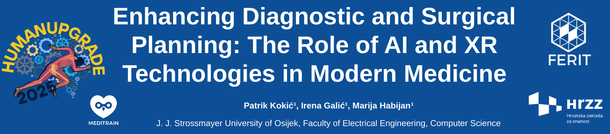

---

##### Download

+ [Paper](poster.pdf)

---

##### Abstract

Advancements in artificial intelligence (AI) and extended reality (XR) are revolutionizing medical diagnostics and surgical planning. AI allows for automated segmentation of medical images, while XR provides immersive 3D visualization of patient-specific anatomy. Deep learning methods, shown in Figure 1., are effective in segmenting complex anatomical structures from MRI and CT scans, such as placental tissue or neurovascular pathways. These segmentations are used to generate 3D models within XR platforms. XR headsets allow real-time visualization of these models during ultrasound or preoperative sessions, enhancing spatial orientation and precision.
---

##### Figure 1: Established and Emerging Methods for Medical XR

---

##### Citation
author: ["Patrik Kokić","Irena Galić","Marija Habijan"]

---

