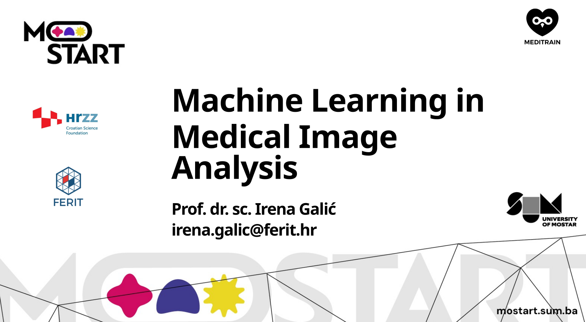

##### Abstract

The integration of extended reality (XR) technologies, virtual, augmented, and mixed reality with artificial intelligence (AI) is transforming medical education, diagnostics, and surgical planning. This mini review explores how established AI methods such as convolutional neural networks (CNNs), recurrent networks (RNNs), generative adversarial networks (GANs), and reinforcement learning (RL) are being used to enhance XR systems for anatomical segmentation, realistic simulation, and autonomous interaction. It also examines emerging approaches, including diffusion models (DMs), vision transformers (ViTs), and multi-modal learning (MML), which enable high-fidelity synthetic data generation, contextual scene understanding, and integration of heterogeneous inputs such as imaging, text, and sensor data. Through use cases in placenta accreta diagnosis and neurovascular intervention planning, we demonstrate how AI-enhanced XR systems can deliver immersive, intelligent, and personalized experiences for clinicians and trainees. We further outline technical challenges, including real-time performance, data variability, and interpretability, and discuss strategies to ensure safe, equitable, and effective adoption of AI-driven XR in healthcare.

---

##### Figure 1: Machine Learning in Medical Image Analysis

---

##### Related material

+ [Presentation slides](mostart2025_presentation.pdf)

