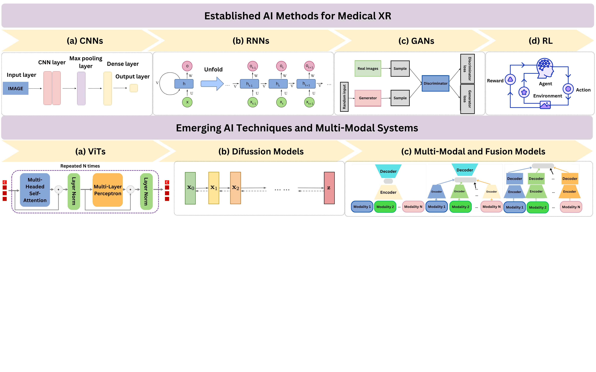

---

##### Download

+ [Paper](paper1.pdf)


---

##### Abstract

The integration of extended reality (XR) technologies, virtual, augmented, and mixed reality with artificial intelligence (AI) is transforming medical education, diagnostics, and surgical planning. This mini review explores how established AI methods such as convolutional neural networks (CNNs), recurrent networks (RNNs), generative adversarial networks (GANs), and reinforcement learning (RL) are being used to enhance XR systems for anatomical segmentation, realistic simulation, and autonomous interaction. It also examines emerging approaches, including diffusion models (DMs), vision transformers (ViTs), and multi-modal learning (MML), which enable high-fidelity synthetic data generation, contextual scene understanding, and integration of heterogeneous inputs such as imaging, text, and sensor data. Through use cases in placenta accreta diagnosis and neurovascular intervention planning, we demonstrate how AI-enhanced XR systems can deliver immersive, intelligent, and personalized experiences for clinicians and trainees. We further outline technical challenges, including real-time performance, data variability, and interpretability, and discuss strategies to ensure safe, equitable, and effective adoption of AI-driven XR in healthcare.

---

##### Figure 1: Established and Emerging Methods for Medical XR



---

##### Citation
author: ["Irena Galić","Marija Habijan","Marin Benčević","Juraj Perić","Hrvoje Leventić","Krešimir Romić","Ivana Hartmann Tolić","Robert Šojo","Aleksandra Pižurica","Danilo Babin","Dario Mužević","Vjekoslav Kopačin","Maja Košuta Petrović","Mirta Vujnovac"]


```BibTeX
@article{galic,
author = {Galić I., Habijan M., Benčević M., Perić J., Leventić H., Romić K., Tolić Hartman I., Šojo R., Pižurica A., Babin D., Mužević D., Kopačin V., Petrović Košuta M., Vujnovac M.},
year = {2025},
title ={Advancing Medical Education and Planning Through Extended Reality: A Mini Review of XR Applications in Medicine},
journal = {International Conference on Digital Transformation in Education and Artificial Intelligence Applications, Mostart 2025}
}
```

---


