#### Team Members

<table>
  <tr>
    <td align="center">
      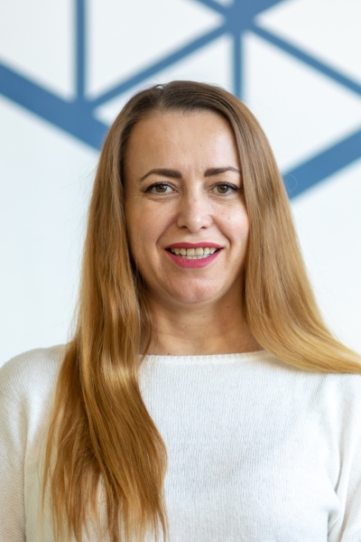 
      <strong>Prof. Irena Galić, PhD</strong> 
      <a href="https://www.ferit.unios.hr/fakultet/imenik-djelatnika#irena-galic">Website</a>
    </td>
    <td align="center">
      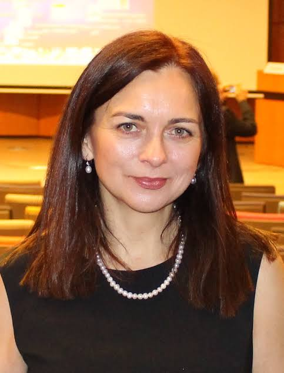 
      <strong>Prof. Aleksandra Pižurica, PhD</strong> 
      <a href="https://ai.ugent.be/people/AleksandraPizurica.en.html">Website</a>
    </td>
    <td align="center">
      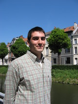 
      <strong>Danilo Babin, PhD</strong> 
      <a href="https://research.ugent.be/web/person/danilo-babin-0/en">Website</a>
    </td>
    <td align="center">
      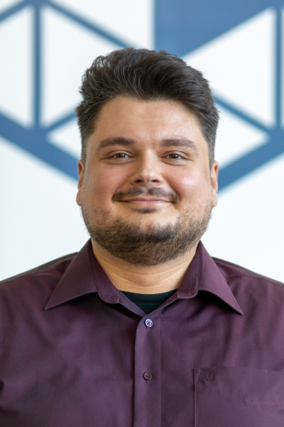 
      <strong>Asst. Prof. Hrvoje Leventić, PhD</strong> 
      <a href="https://www.ferit.unios.hr/fakultet/imenik-djelatnika#hrvoje-leventic">Website</a>
    </td>
  </tr>
  <tr>
    <td align="center">
      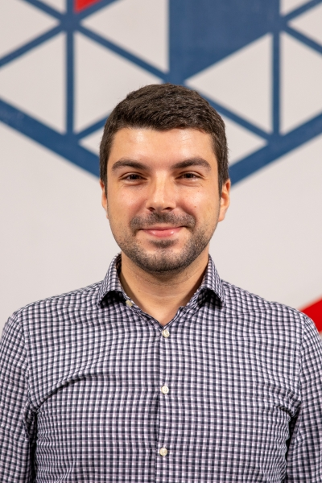 
      <strong>Asst. Prof. Krešimir Romić, PhD</strong> 
      <a href="https://www.ferit.unios.hr/fakultet/imenik-djelatnika#kresimir-romic">Website</a>
    </td>
    <td align="center">
      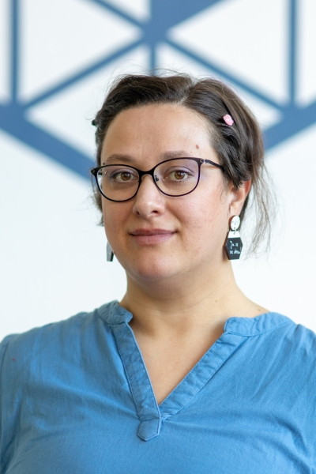 
      <strong>Asst. Prof. Ivana Hartmann Tolić, PhD</strong> 
      <a href="https://www.ferit.unios.hr/fakultet/imenik-djelatnika#ivana-hartmann-tolic">Website</a>
    </td>
    <td align="center">
      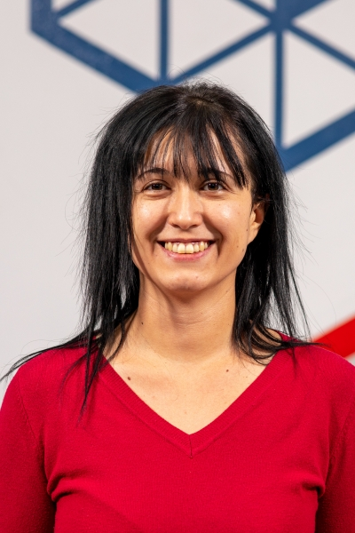 
      <strong>Marija Habijan, PhD Seven</strong> 
      <a href="https://www.ferit.unios.hr/2021/fakultet/imenik-djelatnika#marija-habijan">Website</a>
    </td>
    <td align="center">
      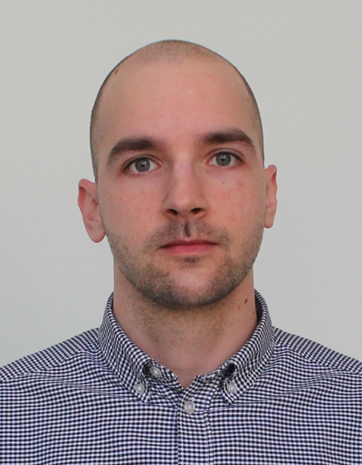 
      <strong>Marin Benčević, PhD</strong> 
      <a href="https://www.ferit.unios.hr/fakultet/imenik-djelatnika#marin-bencevic">Website</a>
    </td>
  </tr>
  <tr>
    <td align="center">
      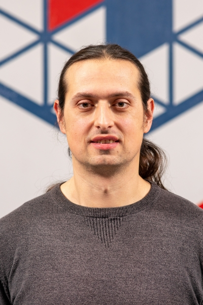 
      <strong>Robert Šojo, mag. ing. comp.</strong> 
      <a href="https://www.ferit.unios.hr/fakultet/imenik-djelatnika#robert-sojo">Website</a>
    </td>
    <td align="center">
      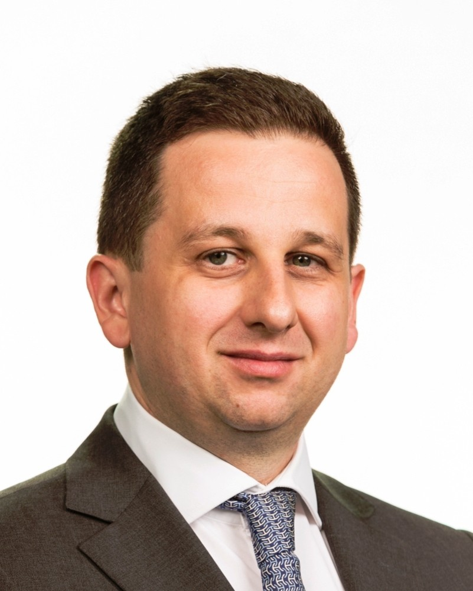 
      <strong>Asst. Prof. Dario Mužević, PhD, Dr. med.Neurosurgeon</strong> 
     <a href="https://hr.linkedin.com/in/dario-mu%C5%BEevi%C4%87-md-phd-5005a7357">Website</a>
    </td>
    <td align="center">
      <strong>Maja Košuta Petrović</strong> 
    </td>
    <td align="center">
      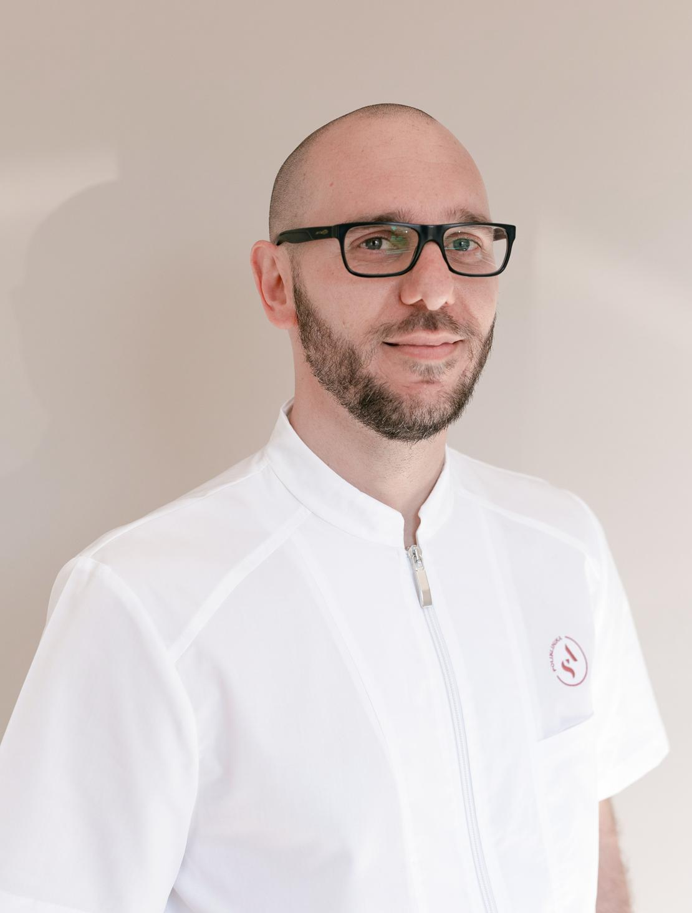 
      <strong>Vjekoslav Kopačin, PhD, Dr. med., Specialist in radiology</strong> 
      <a href="https://poliklinika-svetiante.hr/doctors/vjekoslav-kopacin-dr-med-2/">Website</a>
    </td>
  </tr>
</table>

---

---

